# Cloud Native - Visualising using Grafana


<details><summary><b>Self guided student - video introduction</b></summary>


This video is an introduction to the Visualizing metrics with Grafana lab. Depending on your browser settings it may open in this tab / window or open a new one. Once you've watched it please return to this page to continue the labs.

[](https://youtu.be/upAhbUQ0K7s "Visualizing metrics with Grafana lab introduction video")

---

</details>

## Introduction

This is one of the optional sets of Kubernetes labs

**Estimated module duration** 30 mins.

### Objectives

This module shows how to install the data visualisation tool Grafana and configure it to use Prometheus as a data source. You will then create a simple dashboard using this data, and explore how complex dashboard can be using a pre-built example.

### Prerequisites

The **Prometheus for metrics capture** module must have been completed before you can do this module, and you must have left the Prometheus server running. If you stopped it then follow the instructions to install it again (the deployments will still have the correct annotations.)

## Task 1: Displaying data with Grafana

As we've seen while Prometheus can gather lots of data, it is not exactly the most powerful visualization mechanism.

Grafana on the other hand is a very powerful open source visualization engine and it can take data from many sources, including Prometheus.  The core engine of Grafana is Open source.  However some of the additional component features (for example specific dashboard configurations, plugins for graph types etc.) are not open source.

For this lab we will use a small subset of the open source features only.

## Task 2: Installing Grafana
Like many other Kubernetes services Grafana can be installed using helm. By default the helm chart does not create a volume for the storage of the grafana configuration. This would be a problem in a production environment, so we're going to use the persistent storage option defined in the helm chart for Grafana to create a storage volume. 

  1. Add the Helm repository entry for Grafana 
  
  - `helm repo add grafana https://grafana.github.io/helm-charts`

 ```
"grafana" has been added to your repositories
```

If you have already added the bitnami repository in another module you'll be told it's already there, that's fine.

  2. Update the repository cache
  
  - `helm repo update`

  ```
Hang tight while we grab the latest from your chart repositories...
...Successfully got an update from the "kubernetes-dashboard" chart repository
...Successfully got an update from the "grafana" chart repository
.
.
.
Update Complete. ⎈ Happy Helming!⎈ 
```

Depending on what modules you have done previously the updated repositories list may vary

If your cloud shell session is new or has been restarted then the shell variable `$EXTERNAL_IP` may be invalid, expand this section if you think this may be the case to check and reset it if needed.

<details><summary><b>How to check if $EXTERNAL_IP is set, and re-set it if it's not</b></summary>

**To check if `$EXTERNAL_IP` is set**

If you want to check if the variable is still set type `echo $EXTRNAL_IP` if it returns the IP address you're ready to go, if not then you'll need to re-set it.

**To get the external IP address if you no longer have it**

In the OCI Cloud shell type

  -  `kubectl --namespace ingress-nginx get services -o wide ingress-nginx-controller`
  
  ```
NAME                       TYPE           CLUSTER-IP    EXTERNAL-IP      PORT(S)                      AGE   SELECTOR
ingress-nginx-controller   LoadBalancer   10.96.61.56   132.145.235.17   80:31387/TCP,443:32404/TCP   45s   app.kubernetes.io/component=controller,app.kubernetes.io/instance=ingress-nginx,app.kubernetes.io/name=ingress-nginx
```

The External IP of the Load Balancer connected to the ingresss controller is shown in the EXTERNAL-IP column.

**To set the variable again**

  - `export EXTERNAL_IP=<External IP>`
  
---

</details>


  3. Create a certificate to protect the connection, we'll use step which we installed in the cloud shell setup section of the lab.
  
  - `$HOME/keys/step certificate create grafana.monitoring.$EXTERNAL_IP.nip.io tls-grafana-$EXTERNAL_IP.crt tls-grafana-$EXTERNAL_IP.key --profile leaf  --not-after 8760h --no-password --insecure --ca $HOME/keys/root.crt --ca-key $HOME/keys/root.key`
  
  ```
  Your certificate has been saved in tls-grafana-123.456.789.123.crt.
  Your private key has been saved in tls-grafana-123.456.789.123.key.
```

(The above is example output, your files will be based on the IP you provided)

  4. Now let's create a TLS secret containing this configuration. 
  
  - `kubectl create secret tls tls-grafana --key tls-grafana-$EXTERNAL_IP.key --cert tls-grafana-$EXTERNAL_IP.crt -n monitoring`
  
  ```
  secret/tls-grafana created
  ```

  5. Let's install Grafana itself. In the OCI Cloud Shell type following command, replace `<External IP>` with the IP address of the load balancer we've been using for all the other steps.
  
  - `helm install grafana grafana/grafana --version 6.13.6 --namespace  monitoring  --set persistence.enabled=true --set ingress.enabled=true --set ingress.hosts="{grafana.monitoring.$EXTERNAL_IP.nip.io}" --set ingress.tls[0].secretName=tls-grafana`

  ```
NAME: grafana
LAST DEPLOYED: Wed Jun 30 18:18:59 2021
NAMESPACE: monitoring
STATUS: deployed
REVISION: 1
NOTES:
1. Get your 'admin' user password by running:

   kubectl get secret --namespace monitoring grafana -o jsonpath="{.data.admin-password}" | base64 --decode ; echo

2. The Grafana server can be accessed via port 80 on the following DNS name from within your cluster:

   grafana.monitoring.svc.cluster.local

   If you bind grafana to 80, please update values in values.yaml and reinstall:
   
   securityContext:
     runAsUser: 0
     runAsGroup: 0
     fsGroup: 0

   command:
   - "setcap"
   - "'cap_net_bind_service=+ep'"
   - "/usr/sbin/grafana-server &&"
   - "sh"
   - "/run.sh"
   
   Details refer to https://grafana.com/docs/installation/configuration/#http-port.
   Or grafana would always crash.

   From outside the cluster, the server URL(s) are:
     http://grafana.monitoring.123.456.789.999.nip.io


3. Login with the password from step 1 and the username: admin
```

Note that normally you would not expose Grafana directly like this but woudl use an official certificate. For the lab we're just using a self signed certificate.

Like many helm charts the output has some useful hints in it, specifically in this case how to get the admin password and setup port-forwarding using Kubectl.

  6. Now get the Grafana login password. In the OCI Cloud Shell 
  
  - `kubectl get secret --namespace monitoring grafana -o jsonpath="{.data.admin-password}" | base64 --decode ; echo`
  
  ```
G5gBdejUfBxhzKn4ZrmwhZQTtlXlZ9qaLHpzispm
```

Of course **your** password will vary, this is just an example

  7. **Copy and paste** the password into a text editor so you can use it later.

We need some data to look at, so :

  8. Using the OCI Cloud Shell or your laptop, make a few requests using curl to generate some new data.
  
  -  `curl -i -k -X GET -u jack:password https://store.$EXTERNAL_IP.nip.io/store/stocklevel`

We need to open a web page to the Grafana service. This was displayed in the Helm output, in this example it's `http://grafana.monitoring.123.456.789.999.nip.io` ** but of of thats an example, your's will vary** (and that's not a valid address anyway)

  9. Open a web page (replace `<External IP>`) with the one you just got for the grafana service.
  
  - `https://grafana.monitoring.<External IP>.nip.io`
  

If the browser prompts you about using a self signed certificate accept it. The process for doing this can vary by browser and version, as of August 2020 the following worked, but newer versions may have changed it.

  - In Safari you will be presented with a page saying "This Connection Is Not Private" Click the "Show details" button, then you will see a link titled `visit this website` click that, then click the `Visit Website` button on the confirmation pop-up. To update the security settings you may need to enter a password, use Touch ID or confirm using your Apple Watch.
  
  - In Firefox once the security risk page is displayed click on the "Advanced" button, then on the "Accept Risk and Continue" button
  
  - In Chrome once the "Your connection is not private" page is displayed click the advanced button, then you may see a link titled `Proceed to ....(unsafe)` click that. 
  
We have had reports that some versions of Chrome will not allow you to override the page like this, for Chrome 83 at least one solution is to click in the browser window and type the words `thisisunsafe` (copy and past doesn't seem to work, you need to actually type it). Alternatively use a different browser.


You'll be presented with the Grafana login window
  

  10. Enter **admin** as the user name and then use the Grafana password you copied a few moments ago. 

  11. Press enter to login and go to the Grafana initial config page

  

Before we can do anything useful with Grafana we need to provide it with some data. 

  12. Click the **Add Your First Data Source** icon to start this process

  

  13. Select **Prometheus**  from the list, then when the UI displays it click the **Select** button

  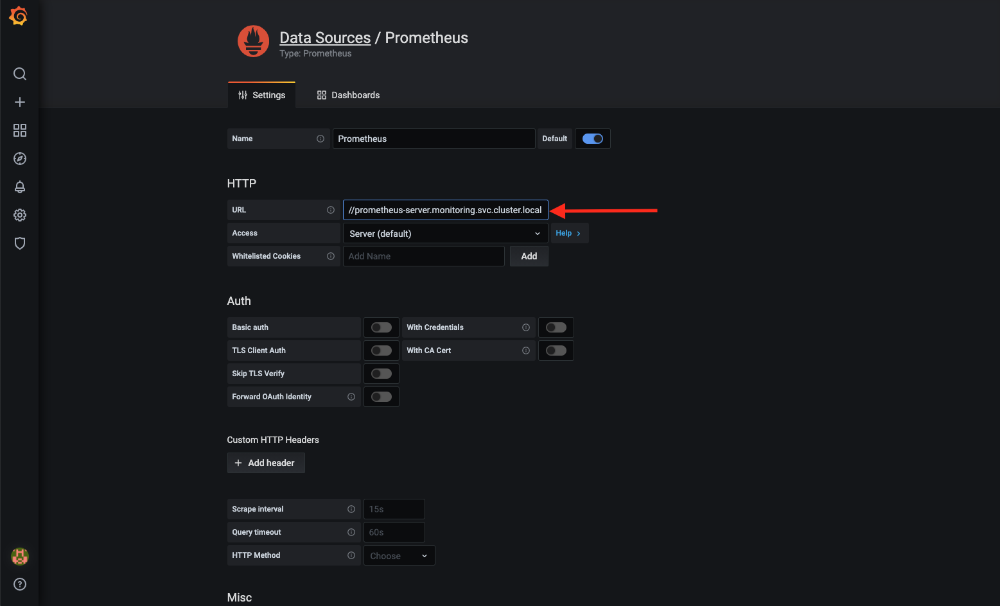

  14. In the **URL** field we need to enter the details we got then we installed Prometheus. Enter the URL 
  
  -  `http://prometheus-server.monitoring.svc.cluster.local`

Leave the other values unchanged

  15. Scroll down and click the **Save & Test** button at the bottom of the screen. 

  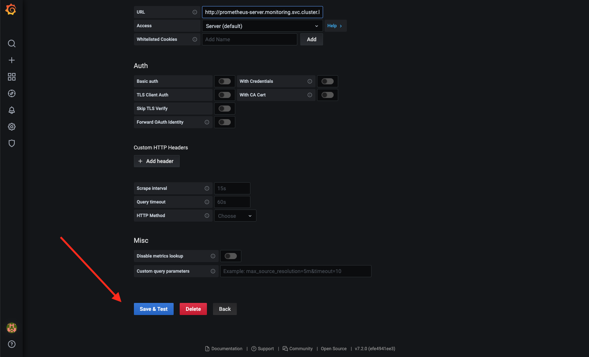

Assuming you entered the details correctly it will report that it's done the save and that the data source is working

  

  16. Click the **Grafana logo**  at the top left to return to the Grafana home page

  
  
## Task 3: Creating our first dashboard

We now need to configure a dashboard that will display data for us.

### Task 3a: Create our initial visualisation

  1. Click the **Create your first dashboard** button to start the process

  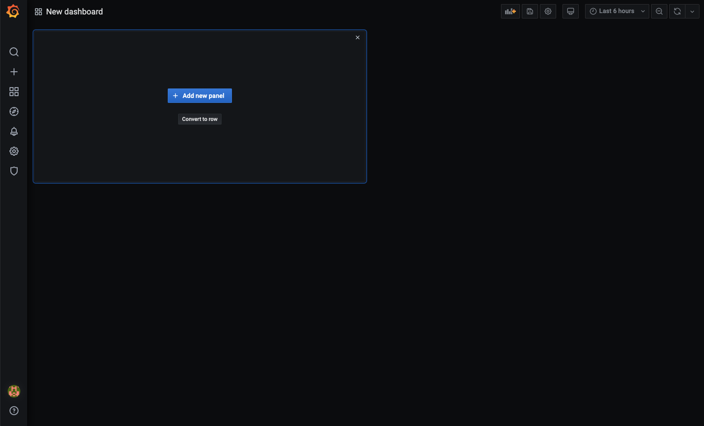

  2. In the new Panel click the **Add new panel** button to define the data we want to retrieve

  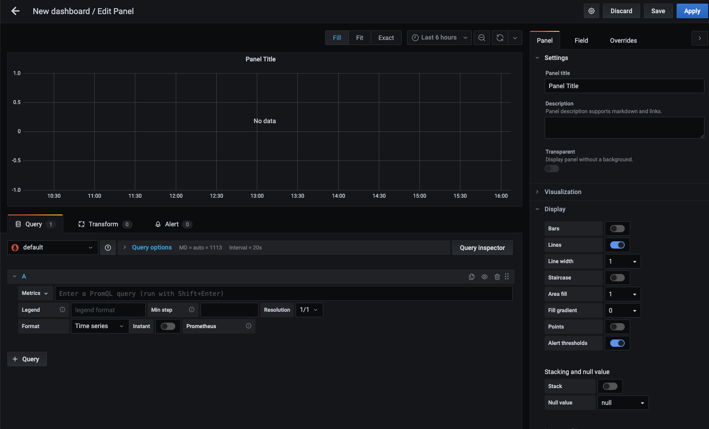

  3. In the Metrics dropdown select `application`, then `application_listAllStockMeter_one_min_rate_per_second` (The list is ordered, so it will probably be a way down)


You may recall that this it the data set for the number of list stock requests made per second averaged over a minute.

Once you've selected it then the display will update with the graph you've selected

  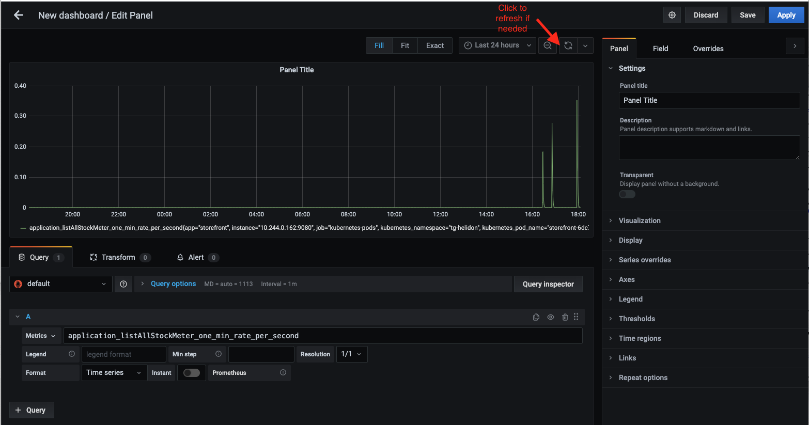
  
If your cloud shell session is new or has been restarted then the shell variable `$EXTERNAL_IP` may be invalid, expand this section if you think this may be the case to check and reset it if needed.

<details><summary><b>How to check if $EXTERNAL_IP is set, and re-set it if it's not</b></summary>

**To check if `$EXTERNAL_IP` is set**

If you want to check if the variable is still set type `echo $EXTRNAL_IP` if it returns the IP address you're ready to go, if not then you'll need to re-set it.

**To get the external IP address if you no longer have it**

In the OCI Cloud shell type

  -  `kubectl --namespace ingress-nginx get services -o wide ingress-nginx-controller`
  
  ```
NAME                       TYPE           CLUSTER-IP    EXTERNAL-IP      PORT(S)                      AGE   SELECTOR
ingress-nginx-controller   LoadBalancer   10.96.61.56   132.145.235.17   80:31387/TCP,443:32404/TCP   45s   app.kubernetes.io/component=controller,app.kubernetes.io/instance=ingress-nginx,app.kubernetes.io/name=ingress-nginx
```

The External IP of the Load Balancer connected to the ingresss controller is shown in the EXTERNAL-IP column.

**To set the variable again**

  - `export EXTERNAL_IP=<External IP>`
  
---

</details>
  

If you don't have any data displayed then make a few requests 

  4. If needed use curl to generate some new data.
  
  -  `curl -i -k -X GET -u jack:password https://store.$EXTERNAL_IP.nip.io/store/stocklevel`
  
  ```
HTTP/2 200 
server: nginx/1.17.8
date: Fri, 27 Mar 2020 09:17:24 GMT
content-type: application/json
content-length: 220
strict-transport-security: max-age=15724800; includeSubDomains

[{"itemCount":4980,"itemName":"rivet"},{"itemCount":4,"itemName":"chair"},{"itemCount":981,"itemName":"door"},{"itemCount":25,"itemName":"window"},{"itemCount":20,"itemName":"handle"}]
```

You can refresh the graph using the refresh icon if you added some new data

  5. Click the time selector and chose a time period where you have data

  

Once you've clicked the time the graph will update

  


You may see multiple pods listed in the legend (above one as a green line in the chart, the other as orange). Do not worry of you can only see one, it depends on the exact flow and timing of the labs which will vary between participants.

Grafana allows us to combine the data using the Prometheus query language, by using the ***SUM*** function in the language to combine all of these.  If you only have one pod do the following anyway, just so see how to use functions)

  6. Click in the **metrics** box and change it to 
  
  - `sum(application_listAllStockMeter_one_min_rate_per_second)` 
  - then press return

  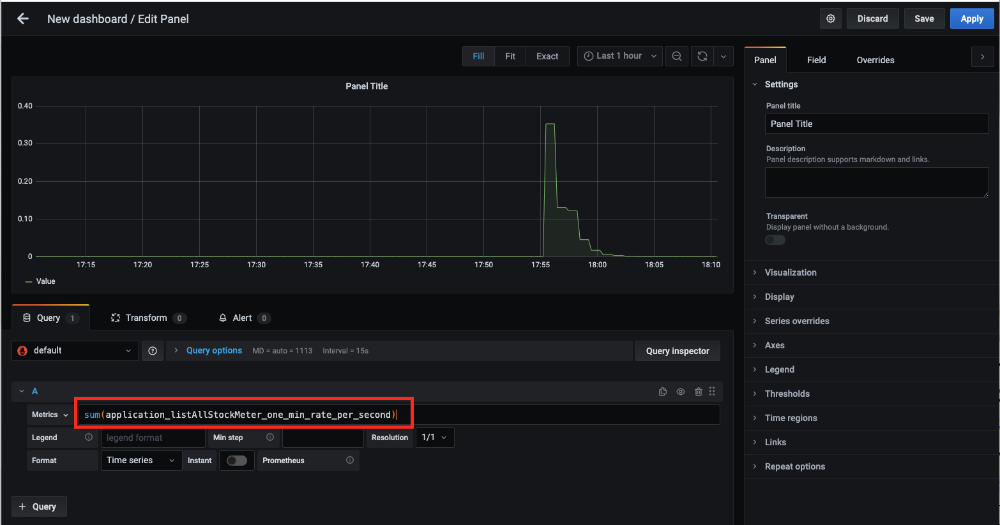

Now any pod that provides the `application_listAllStockMeter_one_min_rate_per_second` data will be part of the total, giving us the total rate across all of the pods.

  7. Click the **Apply** button on the upper right.

  

  8. Make a few requests using curl to generate some new data.
  
  -  `curl -i -k -X GET -u jack:password https://store.$EXTERNAL_IP.nip.io/store/stocklevel`

  ```
HTTP/2 200 
server: nginx/1.17.8
date: Fri, 27 Mar 2020 10:06:39 GMT
content-type: application/json
content-length: 220
strict-transport-security: max-age=15724800; includeSubDomains

[{"itemCount":4980,"itemName":"rivet"},{"itemCount":4,"itemName":"chair"},{"itemCount":981,"itemName":"door"},{"itemCount":25,"itemName":"window"},{"itemCount":20,"itemName":"handle"}]
```

After a bit of time for Helidon to update it's metrics (this is an average over 1 min) Prometheus to get round to scraping them and for Grafana to get round to retrieving them click the refresh icon on the upper right  (We'll look at auto refresh in a bit).

  

If it hasn't updated after a bit you can force the screen to update, click the refresh icon on the upper right  

This is only a visuals update, if the scraping hasn't retrieved the updated data then you'll just have to wait for it to happen.

Once we've defined the query then we can look at the way it's displayed. 

Let's go back and edit the visuals

  9. Click the **Panel Title** then chose **Edit**

  

  10. On the right expand the **Visualization** section

  

You can chose the visualization type you want

  11. Click the **Graph** icon next to the "Visualization" label  to see the selection appear in a grid. 

For now we're going to leave this as a Graph, but if you want try clicking on some of the other options to see what they display, not all data makes sense in all visualization types though.

For now (as there is only a single set of numeric data) we are going to leave this as a line graph, but we'll make it a little more interesting.

  12. Shrink the **Visualization** section and expand the **Display** section on the right

  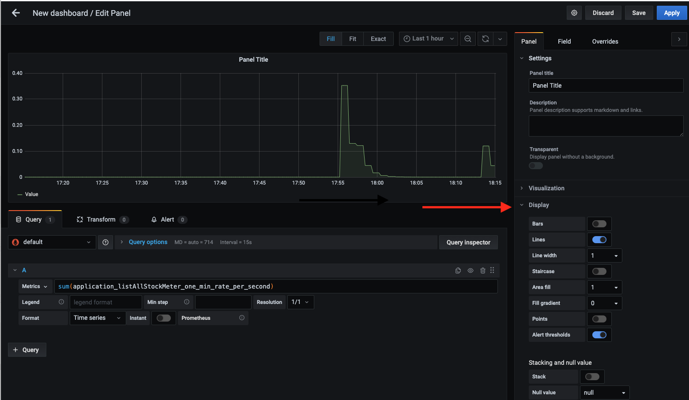

  13. In the **Draw** options make sure that **Bars and Points** are turned off and **Lines** is turned on. 

  

  14. In **Mode** options set **Area Fill** to 3, **Fill Gradient** to 10 and **Line Width** to 2.

  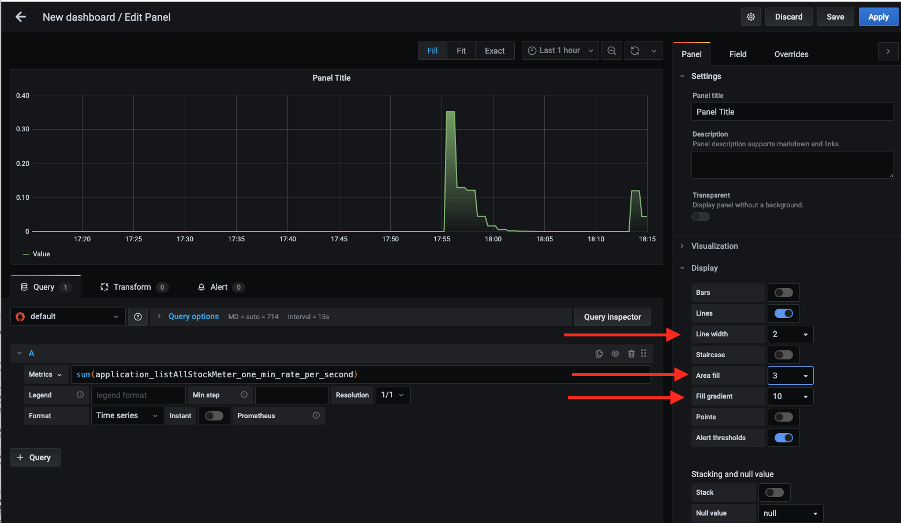

  15. Close the **Display** section of the right hand panel.

  16. Scroll to the top of the right hand panel.

  17. In the **Panel Title** field enter a suitable title, for example  `Stock Listing Requests per second`

  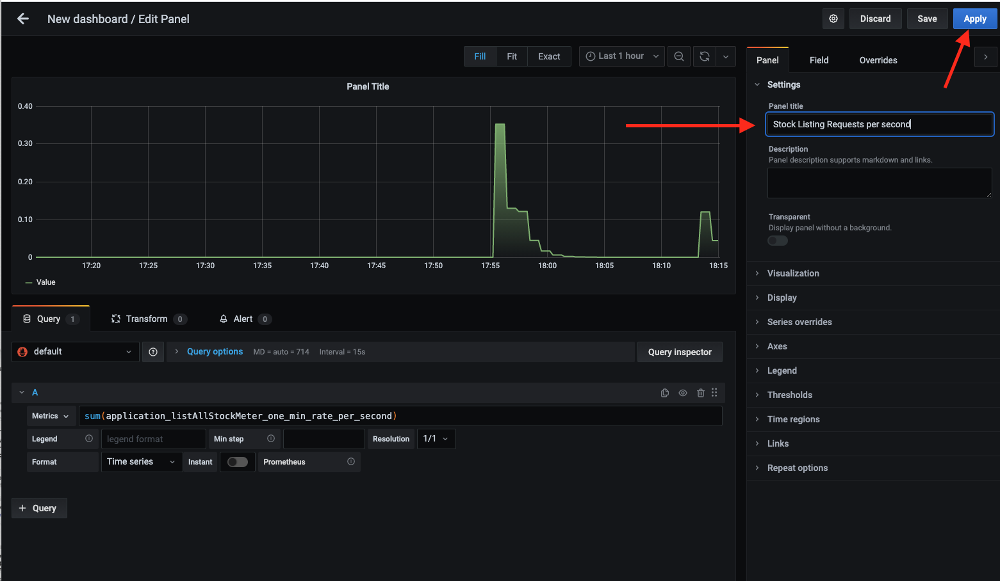

  18. Click the **Apply** button at the top right to return to the New Dashboard

Now we see our dashboard with a graph panel

   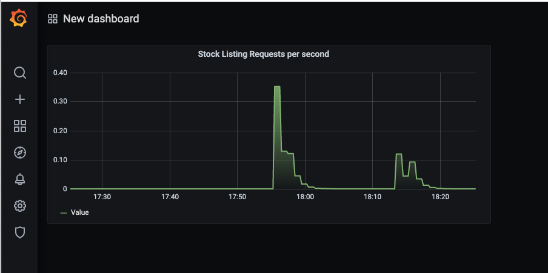
   
### Task 3b: Adding a second panel

Of course this looks pretty basic, It's good to see how many requests we're getting, but let's add an additional panel to give us a history of how many requests we've had . 

  1. Click on the  **Add Panel** icon on the upper right  

  

  2. Click the **Add new panel** button

  2. In the metrics field, enter following (you can copy and paste if you wish)

  - `avg(application_com_oracle_labs_helidon_storefront_resources_StorefrontResource_listAllStockTimer_mean_seconds)` 


  

  4. In the **Visualization** section on the right hand menu. If it's not already selected chose **Graph** as the type
  
  5. In the **Display** section on the right hand menu. Set the **Draw Modes** to have both **Bars** and **Lines** enabled

  

  6. Move to the **Settings** section at the top of the right hand menu 

  7. Title the panel **Response Times**

  

  8. Hit the **Apply** button to return to the New Dashboard

  
  
### Task 3c: Adding a different type of visualisation

We're going to add a 3rd panel with a different visualization type, using a dial graph that gives us a view of the most recent data.

  1. Click the add panel icon then the **Add New Panel** button

  2. Enter for **metrics**
  
  -  `application_com_oracle_labs_helidon_storefront_resources_StorefrontResource_listAllStockTimer_mean_seconds`

  

On the Visualizations section of the right hand menu we're going for a different visualization type. 

  3. In the **Visualization** section on the right hand menu 

  4. Chose the **Gauge** option, the display will update to show a gauge.

  

  5. In the **Display** section make sure that both **Labels** and **Markers** are enabled

  

  6. We now need to define the fields and thresholds. At the top of the right hand menu select **Field**

  

  7. In the field section set the title to be **Current Response Time** the Unit to be seconds (under time in the dropdown) and set the **Min** to be 0 and **Max** to be 5

  

  8. In the Threshold section, click the **Add threshold** button

You can see there are now three thresholds

  

  9. In the text boxes representing the thresholds 
  
  - Set the Red threshold to be 0.1 
  
  - Set the yellow threshold to be 0.05

Note that as you enter the values the order of the boxes may change.

  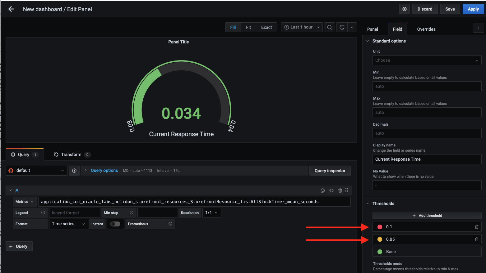

  10. At the top of the right menu switch back to the **Panel**

  11. Remove any text in the panel title

  

  12. Click the **Apply** to return to the New Dashboard

  
  
### Task 3d: Organising the dashboard

We can see what data we're getting, but it's not that easy to look at.

Let's Re-arrange the panels a bit. 

  1. Click on the working of the middle panels title (Response Times) and drag it to the right of the gauge panel.

  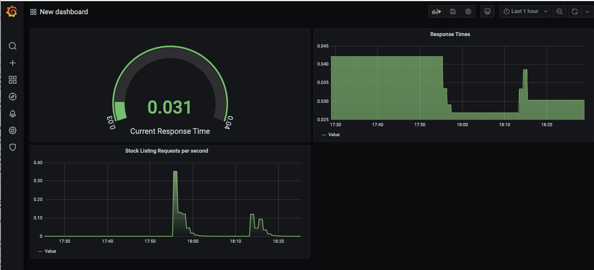

We need to rename our panel, after all "New dashboard" is not especially descriptive. 

  2. Click on the dashboard settings icon 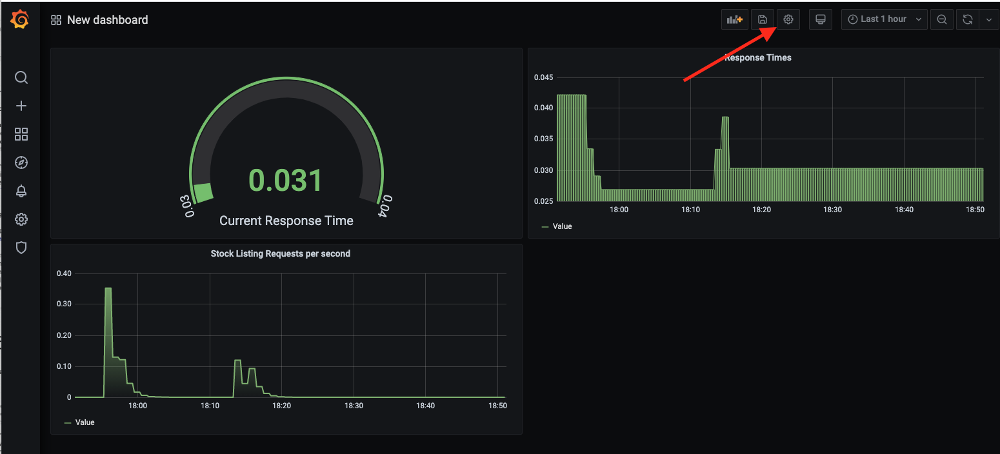 on the upper right of the window

  3. In the settings page give it a name, let's use `Stock Listing performance`, provide a description, and *disable* the editing option

  4. Then click the **Save Dashboard** button

  

  5. In the popup name the dashboard `Stock Listing performance` then chose to save it 

  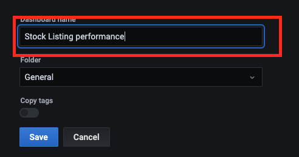

Confirm if prompted (Note you cannot save to the name of an existing dashboard)

  6. Click the **Back** Arrow to exit the settings

  

Now we have our dashboard let's set the auto refresh so as new data becomes available it will be displayed.

  7. Next to the **Refresh** icon click the menu to open up the auto-refresh options list

  - Chose 1 min

  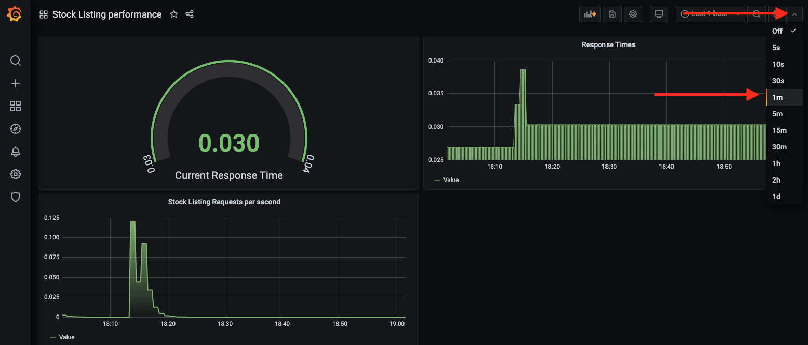


  8. Make a few requests using curl to generate some new data
  
  -  `curl -i -k -X GET -u jack:password https://store.$EXTERNAL_IP.nip.io/store/stocklevel`
  
```
HTTP/2 200 
server: nginx/1.17.8
date: Fri, 27 Mar 2020 13:35:04 GMT
content-type: application/json
content-length: 220
strict-transport-security: max-age=15724800; includeSubDomains

[{"itemCount":4980,"itemName":"rivet"},{"itemCount":4,"itemName":"chair"},{"itemCount":981,"itemName":"door"},{"itemCount":25,"itemName":"window"},{"itemCount":20,"itemName":"handle"}]
```
Within a min or two (remember Helidon, Prometheus and Grafana need to capture and process their data) the UI will update with the requests you've just made

  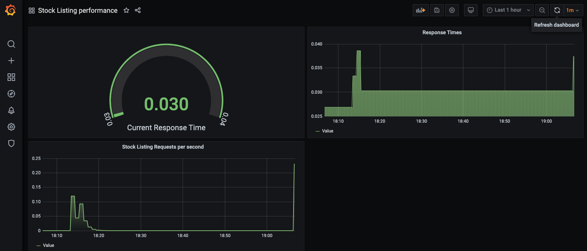


Let's look in a bit more close up

  9. Using the **Duration dropdown** in the upper right change the duration to be the last 5 mins 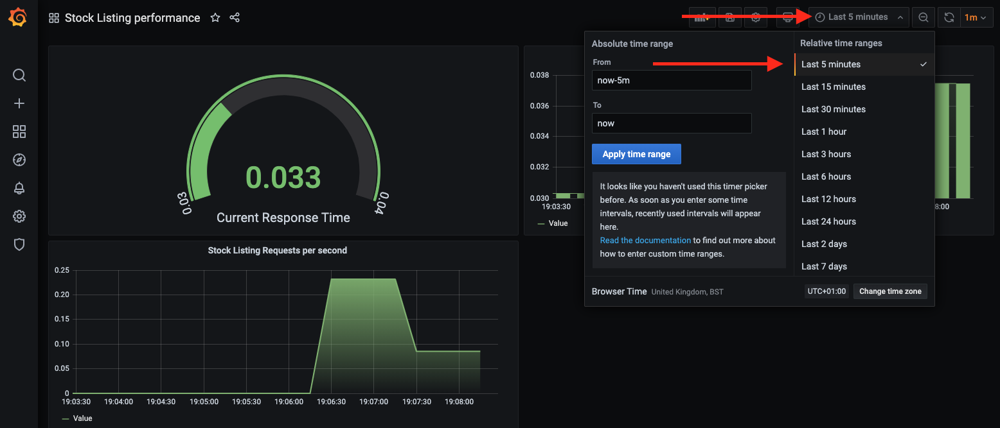

Now we can see more details

  

## Task 4: More complex dashboards
This is a fairly simple dashboard, far more complex ones are easily achievable using a combination or Prometheus and Grafana. As an example we're going to look at a prebuilt dashboard.

  1. Click the **Grafana logo**  on the upper left. 

  2. On the left side menu click the settings **cog**, and then **Datasources**.

  

  3. Click the entry for **Prometheus**

  

  4. To get the list of dashboards click the **Dashboards** tab

  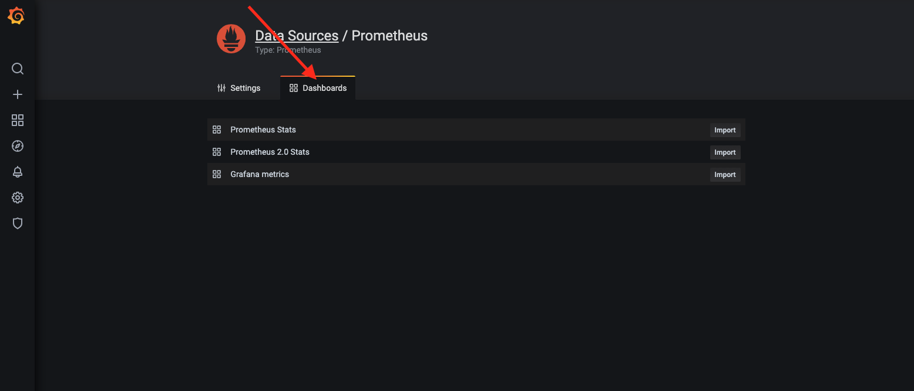

  5. Click on the **import** button for each dashboard, 

The dashbaords will be imported (there will be a quick "I'm doing an import" message after each click) after which we can see they are all imported

  

  6. Click the **Grafana** logo  on the upper left. 
  
  7. Click the **Home** menu  to get a list of available dashboards

  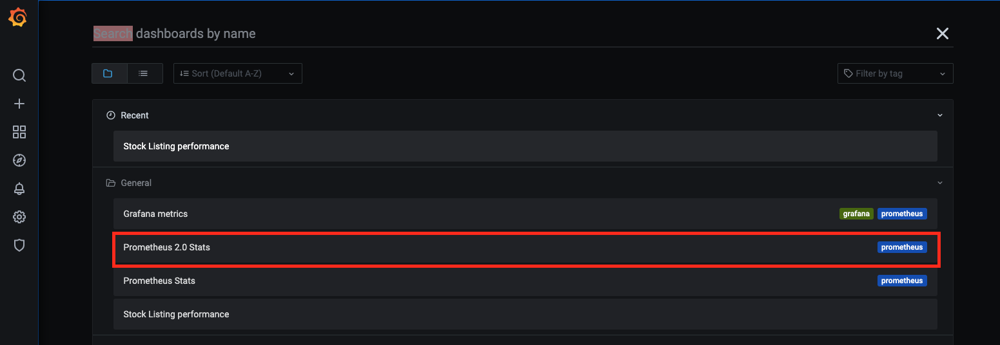

  8. Click on the **Prometheus 2.0 Stats** option to see an example dashboard of stats for Prometheus

  

---

## Task 5: Tidying up the environment

If you are in a trial tenancy there are limitations on how many Load Balancers and other resources you can have in use at any time, and you may need them for other modules. The simplest way to release the resources used in his module (including the load balancer) is to delete the entire namespace.

To delete the monitoring namespace do the following

  1. In the OCI Cloud shell type 
  
  - `kubectl delete namespace monitoring`
  
  ```
namespace "monitoring" deleted
```

## End of the module, What's next ?

You can chose from the various Kubernetes optional module sets.

## Acknowledgements

* **Author** - Tim Graves, Cloud Native Solutions Architect, EMEA OCI Centre of Excellence
* **Contributor** - Jan Leemans, Director Business Development, EMEA Divisional Technology
* **Last Updated By** - Tim Graves, August 2021
